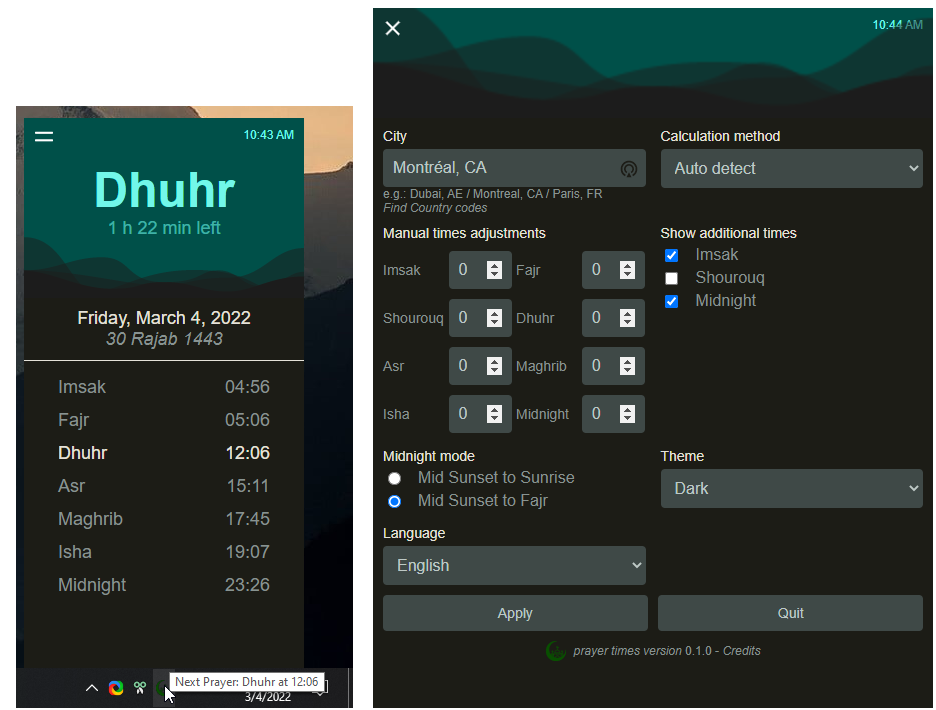
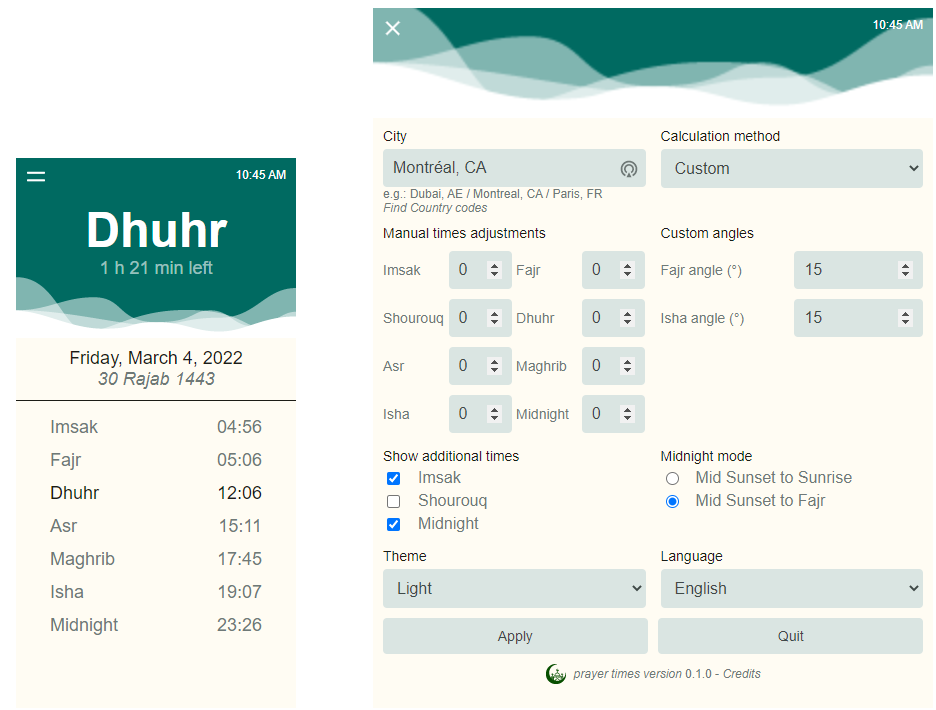

[](https://standardjs.com) 

#  prayer-times-menubar-app

A menubar application for displaying the prayer times from your city.




## Features

- Actual times from any location
- Change the calculation method or custom the angles for Fajr and Isha prayers
- Create your own method by changing the times of the different prayers
- Show additional times like Imsak, Sunrise and Midnight
- Dark and Light mode. Follow by default the system.

#### Geolocation

You can enter your location in the settings panel, just enter: CITY, COUNTRY. <br>
You can use the full name of the country or just the alpha-2 code [ISO 3166](https://www.iso.org/obp/ui/#search/code/). <br>
When using the geolocation button, a request is made to [IPinfo.io API](https://ipinfo.io/) to be able to get the city and country of you location. An internet connection is required.

*This app use the Free plan from ipinfo.io, and can access up to 50k request/month.*

#### Keyboard shortcut

You can use the following shortcuts: <br>
<kbd>Ctrl or Cmd</kbd> + <kbd>Alt</kbd> + <kbd>P</kbd>  Global shortcut to show/hide the app

## Development

- You will need a **TOKEN** from [IPinfo.io](https://ipinfo.io/).
```js
// config.js

const TOKEN = 'your.token'
exports.TOKEN = TOKEN

---
// main.js

function geolocation () {
  console.log('Fetch geolocation via IPinfo.io.')
  // NOTE: Enter your TOKEN from IPinfo.io
  const TOKEN = config.TOKEN

  fetch(`https://ipinfo.io/json?token=${TOKEN}`)
    .then(res => res.json())
    .then(json => {
      // console.log(json.ip, json.city, json.country)
      store.setCityCountry(json.city, json.country)
    })
    .catch(err => console.log(err))
}
```

- [node-fetch](https://github.com/node-fetch/node-fetch/tree/2.x#readme) v2.x is used because the ES Modules are not in use in this app.

## Contributing

Contributions are welcome!

## Translations

Follow these steps to translate the app in you language:
1. Create a folder with the 2 letters of your language in `./locales/`
2. Copy [this file](./locales/en/translation.json) (`./locales/en/translation.json`) in your folder
3. Start translating! :)

Note: the words between braces (e.g.:`{{api}}`) shouldn't be translated.

Available translations:
- English
- French

## Credit | Dependencies

- [Electronjs.org](https://www.electronjs.org/)
- [Menubar](https://github.com/maxogden/menubar)
- [electron-store](https://github.com/sindresorhus/electron-store)
- [node-fetch](https://github.com/node-fetch/node-fetch)
- [RESTful Prayer TImes API](https://aladhan.com/prayer-times-api) from [Aladhan.com](https://aladhan.com/)
- [IPinfo.io](https://ipinfo.io/)
- [Remix Icon](https://github.com/Remix-Design/RemixIcon)
- [i18next](https://www.i18next.com/) internationalization framework
- Logo: Islam by Olena Panasovska from NounProject.com

## Donations
Donations can be made via cryptocurrencies:
- XMR: `88TyfPkBEh44NFwdy5wMtv5M1aJFgNpWq4S97oZhSPwcCr4ah8cWyCRe8qE1Q3n9sAirVF23u6FkMCdSGiJSyLhHN5UcjcL`
- BTC: `bc1qthw8u4he9zj6ajnfqxq6z5ang6w24hdds8j68r`

Thank you!!

## License

[MIT](LICENSE)
